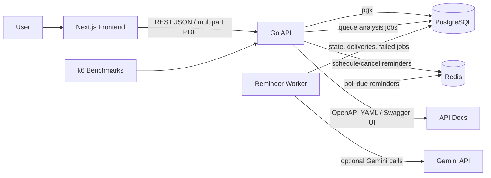

# Architecture

CareerOS is split into a server-rendered Next.js frontend, a Go HTTP API, PostgreSQL, Redis, and a background worker process. The backend uses thin HTTP handlers, service packages for business rules, and a query layer shaped around generated/sqlc-style data access.

## High-Level Structure

```text
career-os/
  backend/
    cmd/
      api/          HTTP API process
      worker/       reminder worker process
      migrate/      Goose migration runner
      seed/         seed command
    internal/
      config/       environment loading and defaults
      db/           PostgreSQL and Redis clients
      httpapi/      routes, handlers, OpenAPI serving, HTTP helpers
      logger/       zerolog configuration
      services/     business rules and orchestration
      workers/      background reminder delivery loop
    migrations/     database schema migrations
    queries/        sqlc query source files
  frontend/
    app/            Next.js App Router pages
    components/     shared UI components
    lib/            API client, domain constants, utilities
  benchmarks/k6/    k6 load-test scripts
  docs/
    reference/     stable API, architecture, environment, and schema docs
    development/   implementation guides, workflow notes, and testing notes
    product/       PRD and roadmap material
```

## Runtime Components

| Component | Entry point | Responsibility |
| --- | --- | --- |
| Frontend | `frontend/app` | Server-rendered operational UI for dashboard, applications, contacts, resume versions, reminders, and analytics. |
| API | `backend/cmd/api/main.go` | Serves `/api/v1/*`, connects to PostgreSQL and Redis, exposes Swagger/OpenAPI docs. |
| Worker | `backend/cmd/worker/main.go` | Polls Redis for due reminders, updates reminder state in PostgreSQL, retries failures, dead-letters exhausted reminder jobs, and optionally processes Gemini-backed AI analysis jobs when `GEMINI_API_KEY` is set. |
| Migrator | `backend/cmd/migrate/main.go` | Applies and rolls back Goose migrations. |
| PostgreSQL | `docker-compose.yml` | Stores companies, applications, resume versions, job descriptions, contacts, interviews, reminders, audit logs, and analytics source data. |
| Redis | `docker-compose.yml` | Stores reminder schedule state used by the API and worker. |

## Backend Layers

```text
HTTP request
  -> chi router and middleware
  -> httpapi handler
  -> service package
  -> db/queries package
  -> PostgreSQL

Reminder API calls
  -> reminders service
  -> PostgreSQL mutation
  -> Redis scheduler update
```

Handlers own HTTP concerns: JSON decoding, path params, status codes, and response writing. Services own validation, status transitions, keyword extraction/scoring, analytics aggregation, reminder scheduling, and transaction-oriented behavior. Query packages own SQL and model mapping.

## Frontend Flow

```text
Next.js page or form
  -> frontend/lib/api.ts
  -> fetch http://localhost:8080/api/v1/*
  -> Go API
  -> JSON response
  -> server-rendered or client-side UI
```

The frontend API base URL is `NEXT_PUBLIC_API_URL` when set, otherwise `http://localhost:8080/api/v1`.

## Data Flow Diagram



## Domain Model

Core entities:

- `companies`: organization metadata.
- `resume_versions`: resume variants, tags, track, optional PDF data.
- `applications`: job opportunities with status, source, dates, role track, company, and optional resume version.
- `application_role_tracks`: optional multi-track labels for applications; `applications.role_track` remains the primary/backward-compatible track.
- `job_descriptions`: raw JD text, extracted keywords, optional summary.
- `contacts`: people associated with companies.
- `interview_rounds`: scheduled rounds and outcomes for an application.
- `reminders`: follow-ups/deadlines with retry state and idempotency keys.
- `audit_logs`: status transition history.
- `role_tracks`: configurable role track names.
- `reminder_deliveries` and `failed_reminder_jobs`: worker reliability records.
- `analysis_jobs`: queued, processing, completed, or failed AI analysis results.

## External Services and Integrations

| Integration | Purpose | Required locally |
| --- | --- | --- |
| PostgreSQL | Primary data store and full-text search vectors. | Yes |
| Redis | Reminder scheduling queue/state. | Yes for API startup and worker |
| Gemini API | Optional structured JD extraction, resume matching, prep briefs, and embeddings. | Only when `GEMINI_API_KEY` is set for the worker |
| Swagger UI CDN | Renders `/api/v1/docs`. | Only needed to view Swagger UI in a browser |
| k6 | Optional benchmark runner. | No |

No third-party authentication, email, notification, or calendar integration is currently wired in code.

## Request Middleware

The API router uses:

- CORS with `Access-Control-Allow-Origin: *`
- Chi request IDs
- Real IP parsing
- Structured request logging
- Panic recovery

## Deployment Notes

The Dockerfile builds three backend binaries: `api`, `worker`, and `migrate`. In the `full` Compose profile, the API container runs migrations before starting:

```sh
./migrate up && ./api
```

The frontend is not included in the backend Dockerfile. Production frontend deployment needs separate hosting or a frontend container.

<!-- TODO: clarify production deployment topology with team -->
