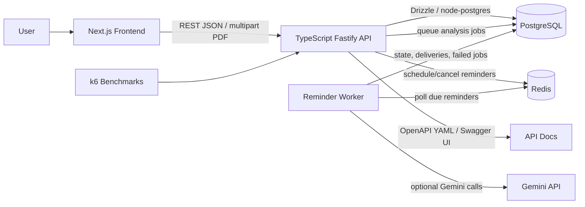

# Architecture

CareerOS is split into a server-rendered Next.js frontend, a TypeScript Fastify API, PostgreSQL, Redis, and a background worker process. The backend uses Zod HTTP contracts, functional domain services, repository interfaces, and Drizzle persistence.

## High-Level Structure

```text
career-os/
  backend/
    src/
      api/          Fastify server and route plugins
      app/          dependency composition
      commands/     API, worker, and migration entry points
      config/       Zod-validated environment configuration
      domain/       business rules and repository contracts
      infrastructure/ PostgreSQL, Redis, Gemini, and migrations
      persistence/  Drizzle repositories and schema mapping
      workers/      reminder and AI-analysis processors
    migrations/     database schema migrations
  frontend/
    app/            Next.js App Router pages
    components/     shared UI components
    lib/            API client, domain constants, utilities
  benchmarks/k6/    k6 load-test scripts
  docs/
    reference/     stable API, architecture, environment, and schema docs
    development/   implementation guides, workflow notes, and testing notes
    product/       PRD and roadmap material
```

## Runtime Components

| Component | Entry point | Responsibility |
| --- | --- | --- |
| Frontend | `frontend/app` | Server-rendered operational UI for dashboard, applications, contacts, resume versions, reminders, and analytics. |
| API | `backend/src/commands/api.ts` | Serves `/api/v1/*`, connects to PostgreSQL and Redis, and exposes Swagger/OpenAPI docs. |
| Worker | `backend/src/commands/worker.ts` | Polls Redis for reminders and optionally processes Gemini-backed AI analysis jobs. |
| Migrator | `backend/src/commands/migrate.ts` | Applies and rolls back the existing Goose-format SQL migrations. |
| PostgreSQL | `docker-compose.yml` | Stores companies, applications, resume versions, job descriptions, contacts, interviews, reminders, audit logs, and analytics source data. |
| Redis | `docker-compose.yml` | Stores reminder schedule state used by the API and worker. |

## Backend Layers

```text
HTTP request
  -> Fastify route and Zod schema
  -> domain service
  -> repository interface
  -> Drizzle repository
  -> PostgreSQL

Reminder API calls
  -> reminders service
  -> PostgreSQL mutation
  -> Redis scheduler update
```

Handlers own HTTP concerns: JSON decoding, path params, status codes, and response writing. Services own validation, status transitions, keyword extraction/scoring, analytics aggregation, reminder scheduling, and transaction-oriented behavior. Query packages own SQL and model mapping.

## Frontend Flow

```text
Next.js page or form
  -> frontend/lib/api.ts
  -> fetch http://localhost:8080/api/v1/*
  -> TypeScript API
  -> JSON response
  -> server-rendered or client-side UI
```

The frontend API base URL is `NEXT_PUBLIC_API_URL` when set, otherwise `http://localhost:8080/api/v1`.

## Data Flow Diagram


```mermaid
flowchart LR
  User[User] --> UI[Next.js Frontend]
  UI -->|REST JSON / multipart PDF| API[TypeScript Fastify API]
  API -->|Drizzle / node-postgres| DB[(PostgreSQL)]
  API -->|schedule/cancel reminders| Redis[(Redis)]
  API -->|queue analysis jobs| DB
  Worker[Reminder Worker] -->|poll due reminders| Redis
  Worker -->|state, deliveries, failed jobs| DB
  Worker -->|optional Gemini calls| Gemini[Gemini API]
  API -->|OpenAPI YAML / Swagger UI| Docs[API Docs]
  Bench[k6 Benchmarks] --> API
```

## Domain Model

Core entities:

- `companies`: organization metadata.
- `resume_versions`: resume variants, tags, track, optional PDF data.
- `applications`: job opportunities with status, source, dates, role track, company, and optional resume version.
- `application_role_tracks`: optional multi-track labels for applications; `applications.role_track` remains the primary/backward-compatible track.
- `job_descriptions`: raw JD text, extracted keywords, optional summary.
- `contacts`: people associated with companies.
- `interview_rounds`: scheduled rounds and outcomes for an application.
- `reminders`: follow-ups/deadlines with retry state and idempotency keys.
- `audit_logs`: status transition history.
- `role_tracks`: configurable role track names.
- `reminder_deliveries` and `failed_reminder_jobs`: worker reliability records.
- `analysis_jobs`: queued, processing, completed, or failed AI analysis results.

## External Services and Integrations

| Integration | Purpose | Required locally |
| --- | --- | --- |
| PostgreSQL | Primary data store and full-text search vectors. | Yes |
| Redis | Reminder scheduling queue/state. | Yes for API startup and worker |
| Gemini API | Optional structured JD extraction, resume matching, prep briefs, and embeddings. | Only when `GEMINI_API_KEY` is set for the worker |
| Swagger UI CDN | Renders `/api/v1/docs`. | Only needed to view Swagger UI in a browser |
| k6 | Optional benchmark runner. | No |

No third-party authentication, email, notification, or calendar integration is currently wired in code.

## Request Middleware

The API server uses:

- CORS with `Access-Control-Allow-Origin: *`
- Fastify request IDs and structured logging
- Zod request and response validation
- centralized error mapping

## Deployment Notes

The multi-stage Dockerfile builds a production Node 22 image containing the API,
worker, migration runner, and SQL files. In the `full` Compose profile, the API
container runs migrations before starting:

```sh
node dist/commands/migrate.js up && node dist/commands/api.js
```

The frontend is not included in the backend Dockerfile. Production frontend deployment needs separate hosting or a frontend container.

<!-- TODO: clarify production deployment topology with team -->
